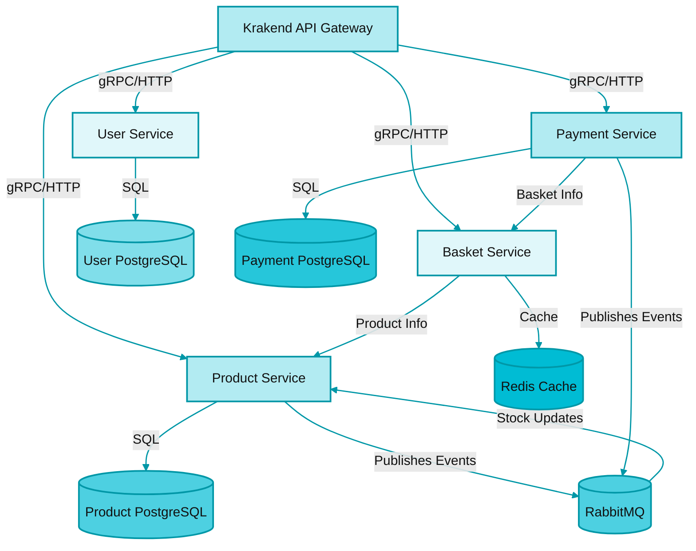
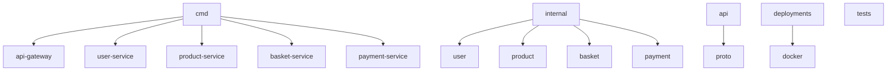

# GoMicro

GoMicro is a modern, microservices-based backend system designed for e-commerce platforms. The architecture leverages Go for high performance and scalability, and integrates PostgreSQL, Redis, and RabbitMQ to ensure robust data management, caching, and asynchronous communication. API Gateway functionality is provided by Krakend, enabling unified and secure access to all services.

## Architecture Overview



## Services and Responsibilities

- **User Service**: Manages user registration, authentication, and profile operations.
- **Product Service**: Handles product CRUD operations and inventory management.
- **Basket Service**: Manages user shopping baskets with high-performance access via Redis.
- **Payment Service**: Processes payments and updates inventory asynchronously using RabbitMQ.
- **API Gateway (Krakend)**: Provides a single entry point for all client requests, routing them to the appropriate microservice.

## Technology Stack

- Go (1.24+)
- PostgreSQL
- Redis
- RabbitMQ
- gRPC
- Krakend (API Gateway)
- Docker & Docker Compose

## Project Directory Structure



## Getting Started

1. **Prerequisites:**
   - Docker & Docker Compose
   - Go 1.24+

2. **Clone the repository:**
   ```bash
   git clone <repo-url>
   cd gomicro
   ```

3. **Start all services:**
   ```bash
   docker-compose up --build
   ```

4. **Access the API Gateway:**
   - http://localhost:8085

## API Gateway Endpoints

| Endpoint         | Method | Service           |
|------------------|--------|-------------------|
| /users           | GET    | User Service      |
| /users           | POST   | User Service      |
| /products        | GET    | Product Service   |
| /products        | POST   | Product Service   |
| /basket          | GET    | Basket Service    |
| /basket          | POST   | Basket Service    |
| /payments        | POST   | Payment Service   |

## Testing

Unit tests for all services are located in the `tests/` directory. To run all tests:

```bash
go test ./tests/...
```

## Protocol Definitions

All inter-service communication is implemented using gRPC. Protocol buffer definitions are located in the `api/proto/` directory.

## Contributing & License

Contributions are welcome via pull requests or issues. Licensed under the MIT License. 